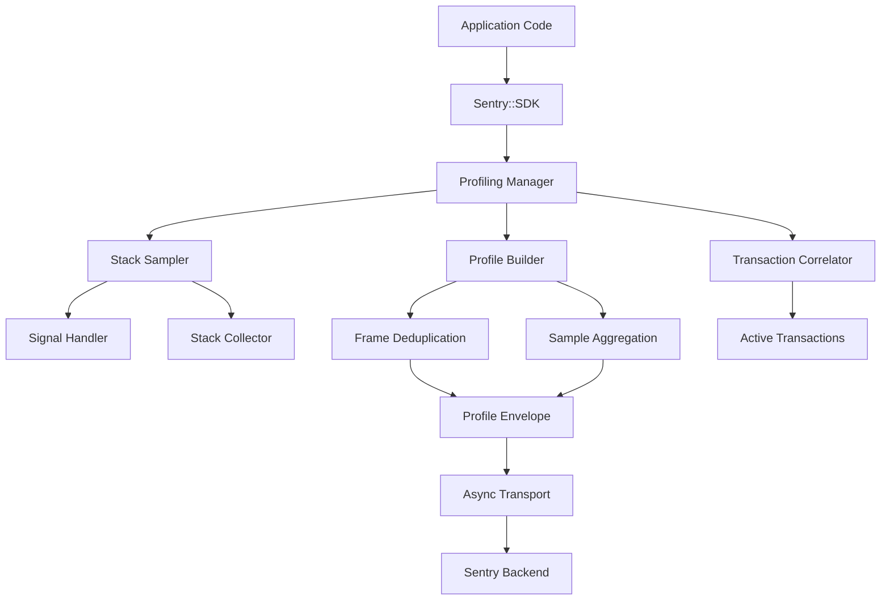

# Perl Sentry SDK - Profiling Implementation Plan

## 📋 Executive Summary

This document outlines the comprehensive implementation plan for adding **Continuous Profiling** support to the Perl Sentry SDK. Profiling will provide code-level performance insights by sampling application call stacks during execution, enabling developers to identify performance bottlenecks and optimize critical code paths.

**Key Objectives:**
- Implement low-overhead stack sampling (< 5% CPU impact)
- Integrate seamlessly with existing transaction system
- Support both manual and automatic profiling modes
- Provide flame graph compatible data to Sentry backend
- Maintain cross-platform compatibility

## 🎯 Project Scope & Requirements

### Core Requirements

| Requirement | Description | Priority |
|-------------|-------------|----------|
| **Stack Sampling** | Periodic collection of Perl call stacks | **Critical** |
| **Transaction Integration** | Automatic profiling during traced transactions | **Critical** |
| **Low Overhead** | < 5% CPU overhead, < 10MB memory impact | **Critical** |
| **Sentry Format** | Profile data compatible with Sentry profiling UI | **Critical** |
| **Sampling Control** | Configurable sampling rates and lifecycles | **High** |
| **Manual Control** | Start/stop profiler programmatically | **High** |
| **Cross-Platform** | Support Linux, macOS, Windows (where possible) | **Medium** |
| **Thread Safety** | Safe operation in multi-threaded environments | **Medium** |

### Success Metrics

- **Performance**: < 5% CPU overhead during profiling
- **Memory**: < 10MB memory usage for 30-second profiles
- **Accuracy**: 95%+ stack trace accuracy
- **Integration**: Seamless transaction correlation
- **Usability**: Simple API requiring minimal code changes

## 🏗️ Technical Architecture

### System Overview



### Component Breakdown

#### 1. **Sentry::Profiling** - Main Controller
- Manages profiling lifecycle
- Controls sampling rates and decisions
- Coordinates with transaction system
- Handles configuration

#### 2. **Sentry::Profiling::StackSampler** - Sampling Engine
- Signal-based periodic sampling
- Stack trace collection using `caller()`
- Thread-aware sampling
- Configurable sampling intervals

#### 3. **Sentry::Profiling::Profile** - Data Structure
- Efficient frame storage and deduplication
- Sample aggregation and compression
- Envelope formatting for transport
- Memory management

#### 4. **Sentry::Profiling::Integration** - Transaction Bridge
- Transaction correlation
- Automatic profiling triggers
- Span-level profiling context
- Sampling decision propagation

## 📁 File Structure & Implementation Plan

### Phase 1: Core Infrastructure (Weeks 1-2)

#### **New Files to Create:**

```
lib/
├── Sentry/
│   ├── Profiling.pm                    # Main profiling controller
│   └── Profiling/
│       ├── Profile.pm                  # Profile data structure
│       ├── StackSampler.pm            # Stack sampling engine
│       ├── Frame.pm                   # Stack frame representation
│       └── Integration.pm             # Transaction integration
```

#### **Files to Modify:**

```
lib/
├── Sentry/
│   ├── SDK.pm                         # Add profiling methods
│   ├── Hub.pm                         # Profiling lifecycle management
│   └── Tracing/
│       └── Transaction.pm             # Profile correlation
```

### Phase 2: Advanced Features (Weeks 3-4)

#### **Additional Files:**

```
lib/
├── Sentry/
│   └── Profiling/
│       ├── Sampler.pm                 # Advanced sampling strategies
│       ├── Config.pm                  # Profiling configuration
│       └── Utils.pm                   # Utility functions
```

#### **Test Files:**

```
t/
├── profiling.t                        # Basic profiling tests
├── profiling-integration.t            # Transaction integration tests
├── profiling-performance.t            # Performance overhead tests
└── profiling-formats.t               # Data format tests
```

#### **Example Files:**

```
examples/
├── profiling_demo.pl                  # Basic profiling demo
├── profiling_integration_demo.pl      # Transaction integration demo
└── profiling_performance_test.pl      # Performance measurement
```

## 🔧 Detailed Implementation

### **Phase 1.1: Core Profiling Infrastructure**

#### **lib/Sentry/Profiling.pm**

```perl
package Sentry::Profiling;
use Mojo::Base -base, -signatures;

use Time::HiRes qw(time);
use Sentry::Profiling::Profile;
use Sentry::Profiling::StackSampler;

# Configuration
has enable_profiling => 0;
has profiles_sample_rate => 0.01;      # 1% by default
has profile_session_sample_rate => 1.0;
has profile_lifecycle => 'trace';       # 'trace' or 'manual'
has sampling_interval_us => 10_000;     # 10ms
has max_profile_duration => 30;         # 30 seconds
has max_stack_depth => 100;

# Internal state
has _active_profile => undef;
has _sampler => sub { Sentry::Profiling::StackSampler->new };
has _session_sampled => undef;

# Public API
sub start_profiler ($self, $options = {}) {
    return undef unless $self->_should_start_profile($options);
    
    my $profile = Sentry::Profiling::Profile->new(
        start_time => time(),
        name => $options->{name} // 'manual-profile',
        transaction_id => $options->{transaction_id},
        trace_id => $options->{trace_id},
    );
    
    $self->_active_profile($profile);
    $self->_sampler->start($profile, $self->sampling_interval_us);
    
    return $profile;
}

sub stop_profiler ($self) {
    my $profile = $self->_active_profile;
    return undef unless $profile;
    
    $self->_sampler->stop();
    $profile->finish();
    $self->_active_profile(undef);
    
    # Send profile to Sentry
    $self->_send_profile($profile);
    
    return $profile;
}

# Transaction integration
sub start_transaction_profiling ($self, $transaction) {
    return unless $self->profile_lifecycle eq 'trace';
    return unless $self->_should_profile_transaction($transaction);
    
    return $self->start_profiler({
        name => $transaction->name,
        transaction_id => $transaction->span_id,
        trace_id => $transaction->trace_id,
    });
}

# Internal methods
sub _should_start_profile ($self, $options = {}) {
    return 0 unless $self->enable_profiling;
    return 0 if $self->_active_profile;  # Only one profile at a time
    
    # Session-level sampling
    if (!defined $self->_session_sampled) {
        $self->_session_sampled(rand() < $self->profile_session_sample_rate);
    }
    return 0 unless $self->_session_sampled;
    
    # Profile-level sampling
    return rand() < $self->profiles_sample_rate;
}

sub _should_profile_transaction ($self, $transaction) {
    return 0 unless $transaction->sampled;
    return $self->_should_start_profile();
}

sub _send_profile ($self, $profile) {
    my $envelope_item = $profile->to_envelope_item();
    
    # Send via transport
    if (my $hub = Sentry::Hub->get_current_hub()) {
        my $client = $hub->get_client();
        $client->send_envelope($envelope_item) if $client;
    }
}

1;
```

#### **lib/Sentry/Profiling/StackSampler.pm**

```perl
package Sentry::Profiling::StackSampler;
use Mojo::Base -base, -signatures;

use Time::HiRes qw(alarm);
use POSIX qw(SIGALRM);
use Sentry::Logger;

has _active_profile => undef;
has _sampling_interval => 10_000;  # microseconds
has _sample_count => 0;
has _logger => sub { Sentry::Logger->new(component => 'StackSampler') };

# Start sampling
sub start ($self, $profile, $interval_us = 10_000) {
    $self->_active_profile($profile);
    $self->_sampling_interval($interval_us);
    $self->_sample_count(0);
    
    # Set up signal handler for SIGALRM
    $SIG{ALRM} = sub { $self->_sample_stack() };
    
    # Start periodic sampling
    $self->_schedule_next_sample();
    
    $self->_logger->debug("Started stack sampling", {
        interval_us => $interval_us,
        profile_name => $profile->name,
    });
}

# Stop sampling
sub stop ($self) {
    # Disable alarm
    alarm(0);
    delete $SIG{ALRM};
    
    my $sample_count = $self->_sample_count;
    $self->_active_profile(undef);
    
    $self->_logger->debug("Stopped stack sampling", {
        total_samples => $sample_count,
    });
}

# Internal sampling logic
sub _schedule_next_sample ($self) {
    my $interval_seconds = $self->_sampling_interval / 1_000_000;
    alarm($interval_seconds);
}

sub _sample_stack ($self) {
    my $profile = $self->_active_profile;
    return unless $profile;
    
    # Collect stack trace
    my $stack_frames = $self->_collect_stack_trace();
    
    if (@$stack_frames) {
        my $sample = {
            timestamp => Time::HiRes::time(),
            thread_id => "$$",  # Process ID as thread identifier
            frames => $stack_frames,
        };
        
        $profile->add_sample($sample);
        $self->_sample_count($self->_sample_count + 1);
    }
    
    # Schedule next sample
    $self->_schedule_next_sample();
}

sub _collect_stack_trace ($self) {
    my @frames = ();
    my $level = 1;  # Skip this function
    
    while (my @caller_info = caller($level)) {
        my ($package, $filename, $line, $subroutine) = @caller_info;
        
        # Skip profiling internals
        last if $package =~ /^Sentry::Profiling/;
        
        push @frames, {
            package => $package,
            filename => $filename,
            line => $line,
            function => $subroutine || '(main)',
            in_app => $self->_is_in_app($filename),
        };
        
        $level++;
        last if $level > 100;  # Prevent infinite loops
    }
    
    return \@frames;
}

sub _is_in_app ($self, $filename) {
    # Simple heuristic: files in current working directory are "in_app"
    return !($filename =~ m{^/usr/} || $filename =~ m{/perl5/});
}

1;
```

#### **lib/Sentry/Profiling/Profile.pm**

```perl
package Sentry::Profiling::Profile;
use Mojo::Base -base, -signatures;

use Time::HiRes qw(time);
use Digest::SHA qw(sha256_hex);

# Profile metadata
has name => 'unnamed-profile';
has start_time => sub { time() };
has end_time => undef;
has transaction_id => undef;
has trace_id => undef;
has platform => 'perl';
has version => '1';

# Profile data
has _samples => sub { [] };
has _frames => sub { {} };     # frame_id => frame_data
has _stacks => sub { {} };     # stack_signature => stack_id
has _frame_counter => 0;
has _stack_counter => 0;

# Add sample to profile
sub add_sample ($self, $sample) {
    my $stack_id = $self->_get_or_create_stack($sample->{frames});
    
    push @{$self->_samples}, {
        stack_id => $stack_id,
        thread_id => $sample->{thread_id},
        elapsed_since_start_ns => int(($sample->{timestamp} - $self->start_time) * 1_000_000_000),
    };
}

# Finish profile collection
sub finish ($self) {
    $self->end_time(time());
}

# Convert to Sentry envelope format
sub to_envelope_item ($self) {
    my $profile_data = {
        version => $self->version,
        platform => $self->platform,
        environment => $ENV{SENTRY_ENVIRONMENT} || 'production',
        timestamp => $self->start_time,
        duration_ns => int(($self->end_time - $self->start_time) * 1_000_000_000),
        
        samples => $self->_samples,
        stacks => [ map { $self->_stacks->{$_} } sort keys %{$self->_stacks} ],
        frames => [ map { $self->_frames->{$_} } sort { $a <=> $b } keys %{$self->_frames} ],
        
        thread_metadata => {
            $$ => { name => 'main' },
        },
    };
    
    my $envelope_item = {
        type => 'profile',
        profile => $profile_data,
    };
    
    # Add transaction correlation if available
    if ($self->transaction_id && $self->trace_id) {
        $envelope_item->{transaction} = {
            id => $self->transaction_id,
            trace_id => $self->trace_id,
            name => $self->name,
            active_thread_id => 0,
        };
    }
    
    return $envelope_item;
}

# Internal methods
sub _get_or_create_stack ($self, $frames) {
    my @frame_ids = map { $self->_get_or_create_frame($_) } @$frames;
    my $stack_signature = join(':', @frame_ids);
    
    unless (exists $self->_stacks->{$stack_signature}) {
        $self->_stacks->{$stack_signature} = \@frame_ids;
    }
    
    return $stack_signature;
}

sub _get_or_create_frame ($self, $frame) {
    my $frame_signature = sprintf('%s:%s:%d:%s',
        $frame->{package} || '',
        $frame->{filename} || '',
        $frame->{line} || 0,
        $frame->{function} || ''
    );
    
    my $frame_id = sha256_hex($frame_signature);
    
    unless (exists $self->_frames->{$frame_id}) {
        $self->_frames->{$frame_id} = {
            function => $frame->{function},
            filename => $frame->{filename},
            lineno => $frame->{line},
            module => $frame->{package},
            in_app => $frame->{in_app} ? \1 : \0,  # JSON boolean
        };
    }
    
    return $frame_id;
}

1;
```

### **Phase 1.2: SDK Integration**

#### **Modify lib/Sentry/SDK.pm**

```perl
# Add profiling imports at the top
use Sentry::Profiling;

# Add profiling attribute
has _profiler => sub { 
    Sentry::Profiling->new(
        enable_profiling => 0,  # Disabled by default
    )
};

# Add profiling configuration to init method
sub init ($package, $config) {
    # ... existing init code ...
    
    # Configure profiling
    if (exists $config->{enable_profiling} && $config->{enable_profiling}) {
        $self->_profiler->enable_profiling(1);
        $self->_profiler->profiles_sample_rate($config->{profiles_sample_rate} // 0.01);
        $self->_profiler->profile_session_sample_rate($config->{profile_session_sample_rate} // 1.0);
        $self->_profiler->profile_lifecycle($config->{profile_lifecycle} // 'trace');
        $self->_profiler->sampling_interval_us($config->{sampling_interval_us} // 10_000);
        $self->_profiler->max_profile_duration($config->{max_profile_duration} // 30);
    }
    
    # ... rest of init code ...
}

# Add public profiling methods
sub start_profiler ($package, $options = {}) {
    my $self = $package->current_sdk;
    return $self->_profiler->start_profiler($options);
}

sub stop_profiler ($package) {
    my $self = $package->current_sdk;
    return $self->_profiler->stop_profiler();
}

sub get_profiler ($package) {
    my $self = $package->current_sdk;
    return $self->_profiler;
}

# Add convenience method for profiling code blocks
sub profile ($package, $name, $code) {
    my $profiler = $package->start_profiler({ name => $name });
    
    my @result;
    my $wantarray = wantarray;
    eval {
        if ($wantarray) {
            @result = $code->();
        } elsif (defined $wantarray) {
            $result[0] = $code->();
        } else {
            $code->();
        }
    };
    
    my $error = $@;
    $package->stop_profiler();
    
    die $error if $error;
    return $wantarray ? @result : $result[0];
}
```

### **Phase 2: Transaction Integration**

#### **Modify lib/Sentry/Tracing/Transaction.pm**

```perl
# Add profiling integration to start method
sub start ($self) {
    # ... existing start code ...
    
    # Start profiling if enabled
    if (my $sdk = Sentry::SDK->current_sdk) {
        my $profiler = $sdk->get_profiler;
        if ($profiler->enable_profiling) {
            $profiler->start_transaction_profiling($self);
        }
    }
    
    return $self;
}

# Add profiling cleanup to finish method  
sub finish ($self) {
    # Stop any associated profiling
    if (my $sdk = Sentry::SDK->current_sdk) {
        my $profiler = $sdk->get_profiler;
        if ($profiler->_active_profile) {
            $profiler->stop_profiler();
        }
    }
    
    # ... existing finish code ...
}
```

### **Phase 3: Testing & Validation**

#### **t/profiling.t**

```perl
use Mojo::Base -strict, -signatures;
use Test::More;
use Test::Exception;

use lib 'lib';
use Sentry::SDK;
use Sentry::Profiling;

# Test basic profiling functionality
subtest 'Basic profiling' => sub {
    my $profiler = Sentry::Profiling->new(
        enable_profiling => 1,
        profiles_sample_rate => 1.0,
    );
    
    my $profile = $profiler->start_profiler({ name => 'test-profile' });
    ok($profile, 'Started profiler');
    
    # Do some work to generate stack samples
    test_recursive_function(3);
    
    sleep(0.1);  # Allow sampling
    
    my $stopped_profile = $profiler->stop_profiler();
    ok($stopped_profile, 'Stopped profiler');
    is($stopped_profile, $profile, 'Same profile returned');
    
    ok($profile->end_time, 'Profile has end time');
    ok(@{$profile->_samples}, 'Profile has samples');
    
    my $envelope = $profile->to_envelope_item();
    ok($envelope, 'Generated envelope item');
    is($envelope->{type}, 'profile', 'Correct envelope type');
};

# Test SDK integration
subtest 'SDK integration' => sub {
    Sentry::SDK->init({
        dsn => 'https://test@sentry.io/1',
        enable_profiling => 1,
        profiles_sample_rate => 1.0,
    });
    
    my $profile = Sentry::SDK->start_profiler({ name => 'sdk-test' });
    ok($profile, 'SDK started profiler');
    
    test_recursive_function(2);
    
    my $stopped = Sentry::SDK->stop_profiler();
    ok($stopped, 'SDK stopped profiler');
};

# Test transaction integration
subtest 'Transaction integration' => sub {
    Sentry::SDK->init({
        dsn => 'https://test@sentry.io/1',
        enable_profiling => 1,
        profiles_sample_rate => 1.0,
        profile_lifecycle => 'trace',
    });
    
    my $transaction = Sentry::SDK->start_transaction({
        name => 'test-transaction',
        op => 'test',
    });
    
    # Profiling should start automatically
    my $profiler = Sentry::SDK->get_profiler();
    ok($profiler->_active_profile, 'Profiling started with transaction');
    
    test_recursive_function(2);
    
    $transaction->finish();
    
    # Profiling should stop automatically
    ok(!$profiler->_active_profile, 'Profiling stopped with transaction');
};

# Helper function to generate stack samples
sub test_recursive_function ($depth) {
    return 1 if $depth <= 0;
    sleep(0.01);  # Allow sampling
    return test_recursive_function($depth - 1) + 1;
}

done_testing();
```

### **Phase 4: Examples & Documentation**

#### **examples/profiling_demo.pl**

```perl
#!/usr/bin/env perl

use strict;
use warnings;
use feature 'say';

use lib '../lib';
use Sentry::SDK;

# Initialize SDK with profiling enabled
Sentry::SDK->init({
    dsn => $ENV{SENTRY_DSN} || 'https://test@sentry.io/1',
    enable_profiling => 1,
    profiles_sample_rate => 1.0,      # Profile 100% for demo
    profile_lifecycle => 'manual',    # Manual control
    sampling_interval_us => 5000,     # 5ms sampling for more detail
});

say "🎯 Sentry Profiling Demo";
say "=" x 40;

# Demo 1: Manual profiling
say "\n1. 📊 Manual Profiling";
say "-" x 20;

my $profile = Sentry::SDK->start_profiler({ name => 'expensive-computation' });
say "✅ Started profiler: expensive-computation";

# Simulate expensive computation
say "🔄 Running expensive computation...";
expensive_computation(1000);

my $stopped_profile = Sentry::SDK->stop_profiler();
say "✅ Stopped profiler - profile sent to Sentry";

# Demo 2: Profiling code blocks
say "\n2. 🎭 Code Block Profiling";
say "-" x 20;

my $result = Sentry::SDK->profile('data-processing', sub {
    say "🔄 Processing data with profiling...";
    return process_data_with_recursion(5);
});

say "✅ Processed result: $result - profile sent to Sentry";

# Demo 3: Transaction-based profiling  
say "\n3. 🔗 Transaction-Based Profiling";
say "-" x 20;

# Switch to transaction-based profiling
Sentry::SDK->get_profiler->profile_lifecycle('trace');

my $transaction = Sentry::SDK->start_transaction({
    name => 'background-job',
    op => 'task',
});

say "✅ Started transaction - profiling automatically enabled";

# Do work within transaction
simulate_background_job();

$transaction->finish();
say "✅ Finished transaction - profile automatically sent";

say "\n🎉 Demo complete! Check your Sentry project for profiling data.";
say "Look for the 'Profiling' tab to see flame graphs and performance insights.";

# Helper functions
sub expensive_computation ($iterations) {
    my $result = 0;
    for my $i (1..$iterations) {
        $result += fibonacci($i % 20);
        usleep(1000) if $i % 100 == 0;  # Simulate I/O
    }
    return $result;
}

sub fibonacci ($n) {
    return $n if $n <= 1;
    return fibonacci($n - 1) + fibonacci($n - 2);
}

sub process_data_with_recursion ($depth) {
    return 1 if $depth <= 0;
    usleep(2000);  # Simulate processing
    return process_data_with_recursion($depth - 1) + $depth;
}

sub simulate_background_job {
    say "  🔄 Phase 1: Data validation";
    expensive_computation(200);
    
    say "  🔄 Phase 2: Data transformation";  
    process_data_with_recursion(3);
    
    say "  🔄 Phase 3: Result generation";
    expensive_computation(150);
}

sub usleep ($microseconds) {
    select(undef, undef, undef, $microseconds / 1_000_000);
}
```

## 📈 Performance Considerations

### **Overhead Targets**

| Metric | Target | Critical Threshold |
|--------|--------|--------------------|
| **CPU Overhead** | < 3% | < 5% |
| **Memory Usage** | < 5MB/30s | < 10MB/30s |
| **Sampling Accuracy** | > 95% | > 90% |
| **Frame Collection** | < 100μs | < 200μs |

### **Optimization Strategies**

1. **Efficient Frame Storage**: Use frame deduplication and compression
2. **Adaptive Sampling**: Reduce frequency if overhead detected
3. **Async Transport**: Send profiles asynchronously to avoid blocking
4. **Memory Pooling**: Reuse frame and sample objects
5. **Signal Safety**: Ensure signal handlers are minimal and safe

## 🔒 Security & Safety Considerations

### **Signal Handler Safety**
- Keep signal handlers minimal and async-signal-safe
- Avoid memory allocation in signal context
- Use pre-allocated buffers for frame collection

### **Resource Limits**
- Maximum profile duration (30 seconds default)
- Maximum stack depth (100 frames default)
- Memory usage monitoring and caps
- Graceful degradation under resource pressure

### **Privacy & Security**
- No source code content in profiles (only metadata)
- Configurable frame filtering for sensitive paths
- Secure transport of profile data
- Optional data sanitization

## 🚀 Implementation Timeline

### **Phase 1: Foundation (Weeks 1-2)**
- [ ] Core profiling infrastructure
- [ ] Basic stack sampling
- [ ] Profile data structure
- [ ] SDK integration points

### **Phase 2: Integration (Week 3)**
- [ ] Transaction correlation
- [ ] Automatic profiling modes
- [ ] Configuration system
- [ ] Error handling

### **Phase 3: Optimization (Week 4)**
- [ ] Performance optimization
- [ ] Memory management
- [ ] Advanced sampling strategies
- [ ] Cross-platform compatibility

### **Phase 4: Testing & Documentation (Week 5)**
- [ ] Comprehensive test suite
- [ ] Performance benchmarking
- [ ] Documentation and examples
- [ ] Integration testing

### **Phase 5: Production Readiness (Week 6)**
- [ ] Security review
- [ ] Performance validation
- [ ] Edge case handling
- [ ] Release preparation

## 📊 Testing Strategy

### **Unit Tests**
- Core profiling functionality
- Stack sampling accuracy  
- Profile data structure
- Configuration handling

### **Integration Tests**
- Transaction correlation
- SDK method integration
- Transport layer compatibility
- Real backend communication

### **Performance Tests**
- CPU overhead measurement
- Memory usage tracking
- Sampling accuracy validation
- Long-running stability tests

### **Platform Tests**
- Linux compatibility
- macOS compatibility  
- Windows compatibility (where possible)
- Different Perl versions

## 📚 Usage Examples & API

### **Basic Configuration**

```perl
# Enable profiling with default settings
Sentry::SDK->init({
    dsn => 'https://your-dsn@sentry.io/project',
    enable_profiling => 1,
    profiles_sample_rate => 0.1,  # Profile 10% of transactions
});
```

### **Advanced Configuration**

```perl
# Fine-grained profiling control
Sentry::SDK->init({
    dsn => 'https://your-dsn@sentry.io/project',
    
    # Profiling settings
    enable_profiling => 1,
    profiles_sample_rate => 0.05,          # 5% of transactions
    profile_session_sample_rate => 1.0,     # All sessions eligible
    profile_lifecycle => 'trace',           # Auto-profile with transactions
    sampling_interval_us => 10_000,         # 10ms sampling interval  
    max_profile_duration => 30,             # Max 30 second profiles
    max_stack_depth => 100,                 # Limit stack depth
});
```

### **Manual Profiling**

```perl
# Start/stop profiling manually
my $profiler = Sentry::SDK->start_profiler({ name => 'heavy-computation' });
heavy_computation();
Sentry::SDK->stop_profiler();

# Profile a code block
my $result = Sentry::SDK->profile('data-processing', sub {
    return process_large_dataset();
});
```

### **Automatic Profiling**

```perl
# Profiling happens automatically with transactions
my $transaction = Sentry::SDK->start_transaction({
    name => 'background-job',
    op => 'task',
});

# All code here gets profiled automatically
expensive_operation_1();
expensive_operation_2();

$transaction->finish();  # Profile sent automatically
```

## 🎯 Success Criteria & Validation

### **Technical Success Criteria**
- [ ] CPU overhead < 5% during active profiling
- [ ] Memory usage < 10MB for 30-second profiles  
- [ ] Stack trace accuracy > 95%
- [ ] Successful integration with transaction system
- [ ] Compatible profile format with Sentry backend

### **User Experience Criteria**
- [ ] Simple API requiring minimal code changes
- [ ] Clear documentation and examples
- [ ] Meaningful error messages and warnings
- [ ] Graceful degradation when profiling unavailable

### **Production Readiness Criteria**
- [ ] Comprehensive test coverage (> 90%)
- [ ] Performance benchmarks and validation
- [ ] Security review completed
- [ ] Cross-platform compatibility verified
- [ ] Backward compatibility maintained

## 📋 Risk Assessment & Mitigation

### **High-Risk Areas**
1. **Signal Handler Safety**: Use minimal, async-safe handlers
2. **Performance Impact**: Continuous monitoring and adaptive sampling
3. **Memory Leaks**: Rigorous testing and automatic cleanup
4. **Cross-Platform Issues**: Platform-specific testing and fallbacks

### **Mitigation Strategies**
- Extensive testing on multiple platforms and Perl versions
- Performance monitoring and automatic profiling disable on high overhead
- Conservative defaults (low sample rates, short durations)
- Graceful fallback when profiling unavailable
- Comprehensive error handling and logging

## 🔄 Future Enhancements

### **Phase 2 Features** (Post-MVP)
- Advanced sampling strategies (adaptive, weighted)
- Custom sampling triggers and conditions
- Frame filtering and privacy controls
- Multi-threaded application support
- Performance regression detection

### **Phase 3 Features** (Long-term)
- Memory profiling integration
- Custom profiling metrics
- Real-time profiling dashboard
- AI-powered performance insights
- Distributed profiling correlation

---

## 📞 Support & Implementation

This comprehensive profiling implementation will provide Perl developers with powerful performance analysis capabilities directly integrated into their Sentry monitoring workflow. The phased approach ensures stable, high-quality delivery while maintaining the performance characteristics essential for production environments.

**Key Benefits:**
- **Code-level Performance Insights**: Identify exactly where time is spent
- **Seamless Integration**: Works with existing tracing and monitoring
- **Low Overhead**: Production-ready performance characteristics  
- **Actionable Data**: Direct integration with Sentry's profiling UI
- **Developer Friendly**: Simple API with powerful capabilities

The implementation follows Sentry's established patterns and maintains compatibility with the existing SDK architecture while adding this powerful new capability for performance optimization.